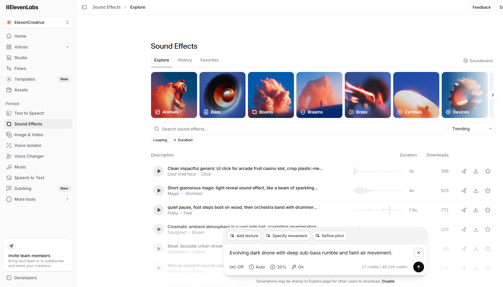
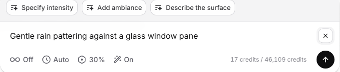
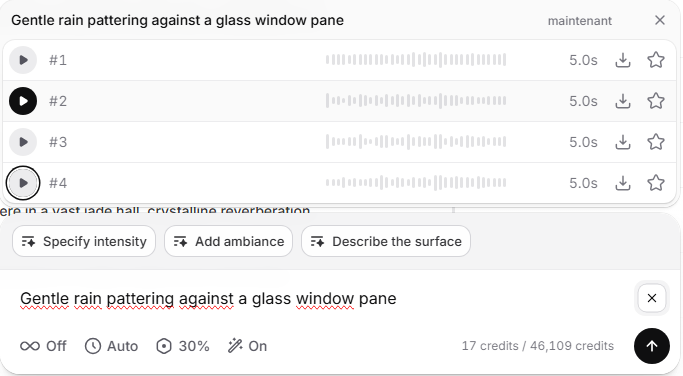
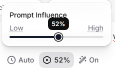

Chercher le bon bruitage dans une banque de sons, c'est dix onglets ouverts, des licences à vérifier et souvent le son qui ne colle pas tout à fait. L'IA renverse le problème : tu décris le son que tu veux, et tu l'obtiens en quelques secondes. Voici comment ça marche, avec ElevenLabs comme exemple concret.

## Le principe : du texte vers le son

Un générateur d'effets sonores par IA fonctionne comme un générateur de voix, mais pour les bruitages. Tu écris une description — « pas lourds sur du gravier », « porte qui grince », « notification douce » — et l'outil produit un clip audio correspondant. Pas de fouille dans des bibliothèques, pas de fichier à licencier séparément : tu génères exactement le son dont tu as besoin.

Plusieurs outils proposent cette fonction aujourd'hui. ElevenLabs est l'un des plus simples à prendre en main, c'est donc celui que je montre ici — mais le principe reste le même ailleurs.

## Pourquoi c'est utile pour une chaîne YouTube

- **Gain de temps.** Plus besoin de parcourir des banques de sons : tu décris, tu génères, tu intègres.
- **Sur-mesure.** Tu obtiens le son précis qui colle à ta scène, pas un « à peu près » trouvé en ligne.
- **Licence claire.** Sur les plans payants d'ElevenLabs, les sons générés sont utilisables commercialement — un casse-tête en moins par rapport aux fichiers glanés un peu partout.

## La méthode pas à pas avec ElevenLabs

**1. Accède à la fonctionnalité Sound Effects.** Depuis ton tableau de bord ElevenLabs, ouvre l'outil Sound Effects. Note qu'elle est disponible sur les plans payants (à partir du Starter, autour de 5 $/mois) — le plan gratuit ne couvre pas l'usage commercial.

**2. Écris une description précise.** C'est l'étape qui fait tout. Plus ta description est concrète, meilleur est le résultat. Compare :

- ❌ « pluie »
- ✅ « pluie fine sur une fenêtre, ambiance calme »

Donne la matière, l'intensité, l'ambiance. Tu écris en français, mais si un son sort mieux décrit en anglais, teste les deux : comme pour la voix, l'anglais reste la langue de prédilection de l'outil.

**3. Règle la durée et l'influence du prompt.** Tu peux ajuster la longueur du clip et le curseur d'influence du prompt (à quel point l'IA colle à ta description plutôt que d'improviser). Pour un bruitage précis, monte l'influence ; pour une ambiance plus libre, baisse-la.

**4. Génère et écoute.** Chaque génération coûte un petit nombre de crédits, pris dans le même quota que ta voix off. Génère plusieurs variantes et garde la meilleure — c'est rapide.

**5. Exporte et intègre au montage.** Télécharge ton clip — privilégie le format **WAV** si tu comptes le retravailler, c'est la meilleure qualité pour le montage. Ensuite, tu l'intègres dans ton logiciel de montage par-dessus ta vidéo.

<audio controls src="/audio/bruit_pluie.mp3">
  Bruit de la pluie
</audio>

## Une astuce de prompt qui marche

N'hésite surtout pas à jouer avec le Prompt Influence qui va beaucoup aider durant la génération d'effet sonores afin d'avoir de meilleur rendue et plus de possibilié. Pense ton effet comme une phrase complète : **source du son + action + contexte**. « Une tasse en céramique posée sur une table en bois », « épée tirée de son fourreau, métal », « clavier mécanique, frappe rapide ». Cette structure donne des résultats bien plus nets qu'un mot isolé.

## Les limites à connaître

- **Pas d'éditeur intégré.** ElevenLabs génère le son, mais pour le couper, le superposer ou ajuster le volume, il te faut un logiciel externe (Audacity, gratuit, suffit largement).
- **Ça consomme des crédits.** Les générations puisent dans le même quota que ta voix off. Si tu enchaînes les essais, surveille ta consommation.
- **Le résultat dépend du prompt.** Comme pour la voix, un son médiocre vient presque toujours d'une description trop vague. Affine, régénère, compare.

## En résumé

Générer des effets sonores avec l'IA, c'est rapide, sur-mesure, et ça évite la corvée des banques de sons. La clé tient en une phrase : **décris ton son précisément**. Le reste n'est que réglages.

Si tu fais déjà de la voix off, c'est le complément naturel — d'ailleurs, la méthode pour soigner ta narration est dans mon [guide de la voix off IA en français](/blog/voix-off-ia-francais-youtube), et mon [avis complet sur ElevenLabs](/blog/avis-elevenlabs) détaille tout ce que l'outil sait faire au-delà du bruitage.

<!-- EMPLACEMENTS LIENS AFFILIÉS (à activer plus tard) :
     - Étape 1 (mention du plan Starter/payant)
     - Conclusion
     Programme ElevenLabs : PartnerStack, 22% récurrent 12 mois, cookie 90j.
     MAILLAGE INTERNE : liens posés vers le tutoriel et l'avis. Penser au lien retour
     depuis ces articles si pertinent. -->
